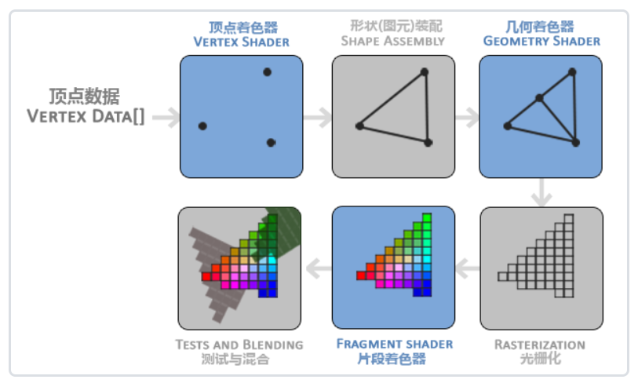
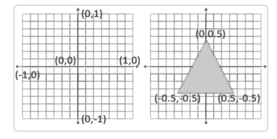

## 双缓冲
应用程序使用单缓冲绘图时可能会存在图像闪烁的问题。这是因为生成的图像不是一下子被绘制出来的，而是按照从左到右，由上而下逐像素绘制而成的。最终图像不是在瞬间显示给用户，二十通过一步一步生成的，这回到值渲染的结果很不真实。为了规避这些问题，我们应用双缓冲如渲染窗口应用程序。前缓冲保存着最终输出的图像，它会在屏幕上显示；而所有的渲染指令都会在后缓冲上绘制。当所有的渲染指令执行完毕后，我们交换(SWap)前缓冲和后缓冲，这样图像就能立即呈现出来，之前提到的不真实感就消除了。

这里提到的前缓冲和后缓冲相当于foreground和background，background就是执行渲染指令，执行完后的内容就是需要在屏幕显示的图像，然后将background的内容交换到foreground里面去显示就行。


## 图形渲染管线
在OpenGL中，任何事物都在3D空间中，而屏幕和窗口却是2D像素数组，这导致OpenGL的大部分都是关于把3D坐标转变为适应你屏幕的2D像素。3D坐标转为2D坐标的处理过程是由OpenGL的**图形渲染管线**（Graphics Pipeline）。实际上指的是一堆原始图形数据途径一个输送管道，期间经过各种变化处理，最终出现在屏幕的过程。图形渲染管线可以被划分为两个主要部分：第一部分把你的3D坐标转换为2D坐标，第二部分是把2D坐标转变为实际的有颜色的像素。

图形渲染管线接受一组3D坐标，然后把它们转变为屏幕上的有色2D屏幕输出。图形渲染管线可以被分为几个阶段，每个阶段将会把前一个阶段的输出作为输入。所有这些阶段都是高度专门化的（它们都有一个特定的函数），并且很容易并行执行。正是由于它们具有并行执行的特性，当今大多数显卡都有成千上万的小处理核心，它们在GPU上为每一个（渲染管线）阶段运行各自的小程序，从而在图形渲染管线中快速处理你的数据。这些小程序叫做**着色器**(Shader)。

有些着色器可以由开发者配置，因为允许用户自己写的着色器来代替默认的，所以能够更细致的控制图形渲染管线中的特定部分了。因为它们运行在GPU上，所以节省了宝贵的CPU时间。OpenGL着色器使用OpenGL着色器语言（OPenGL Shading Language,GLSL)写成的

下面，你会看到一个图形渲染管线管线的每个阶段的抽象显示。要注意蓝色部分代表的是我们可以注入自定义的着色器的部分：



首先，我们以数组的形式传递3个3D坐标作为图形渲染管线的输入，用来表示一个三角形，这个数组叫做顶点数据（Vertex Data）；顶点数据是一系列顶点的集合。一个顶点（Vertex）是一个3D坐标的数据的集合。而顶点数据使用顶点属性（Vertex Attribute）表示的，它可以包含任何我们想用的数据。

> 为了让OpenGL知道我们的坐标和颜色值构成的到底是什么，OpenGL需要你去指定这些数据所表示的渲染类型。我们是希望把这些数据渲染成一系列的点？一系列的三角形？还是仅仅是一条条长长的线？做出的这些提示叫做图元（Primitive），任何一个绘制指令的调用都将图元传递给OpenGL。其中几个：
GL_POINTS, GL_TRIANGLES，GL_LINE_STRIP。

图形渲染管线的第一个部分是顶点着色器（Vertex Shader），它把一个单独的顶点作为输入。顶点着色器主要的目的是把3D坐标转为另一个3D坐标，同时顶点着色器允许我们对顶点属性进行一些基本处理。

图元装配（Primitive Assembly）阶段将顶点着色器输出的所有顶点作为输入，并将所有的点装配成指定图元的形状。

图元装配阶段的输出会传递给几何着色器（Geometry Shader）。几何着色器把图元形式的一系列顶点的集合作为输入，它可以通过产生新顶点构造出新的图元来生成其他形状。

几何着色器的输出会被传入光栅化阶段（Rasterization Stage），这里它会把图元映射为最终屏幕上相应的像素，生成供片段着色器（Fragment Shader）使用的片段（Fragment）。在片段着色器运行之前会执行裁切（Clipping）。裁切会丢弃超出你的视图以外的所有像素，用来提升执行效率。
> OpenGL中的一个片段是OpenGL渲染一个像素所需的所有数据

片段着色器的主要目的是计算一个像素的最终颜色，这也是所有OpenGL高级效果产生的地方。通常，片段着色器包含3D场景的数据（比如光照，阴影，光的颜色等等），这些数据可以被用来计算最终像素的颜色。

在所有对应颜色值确定以后，最终的对象将会被传到最后一个阶段，我们叫做Alpha测试和混合（Blending）阶段。这个阶段检测片段的对应的深度（和模板（Stencil））值，用他们来判断这个像素是其他物体的前面还是后面，决定是否应该丢弃。这个阶段也会检查alpha值并对物体进行混合（Blend）。所以，即使片段着色器中计算出来了一个像素要输出的颜色，在渲染多个三角形的时候最后的像素颜色也可能完全不同。

大多数场合，我们只需要配置顶点和片段着色器就行了。几何着色器是可选的，通常使用默认着色器就行了。

在现代OpenGL中，我们必须定义至少一个顶点着色器和一个片段着色器（因为GPU中没有默认的顶点/片段着色器）。

## 顶点输入
顶点输入的坐标系为标准化设备坐标，当然也可以不是，你可以在顶点着色器中进行转换等，只不过我们现在省略了转换步骤，直接定义成了标准化坐标系的坐标，范围为[-1.0, 1.0], 
```cpp
float vertices[] = {
  -.5f, -.5f, 0.0f,
  0.5f, -0.5f, 0.0f,
  0.0f, 0.5f, 0.0f
}
```
> 通常深度可以理解为z坐标，它代表一个像素在空间中和你的距离，如果离你远就可能被别的像素遮挡，你就看不到它了，它就会被丢弃，以节省资源。

定义这样的顶点数据以后，我们会把它作为输入发送给图形渲染管线的第一个处理阶段：顶点着色器。它会在GPU上创建内存用于存储我们的顶点数据，还要配置OpenGL如何解释这些内存，并且指定其如何发送给显卡。

一旦你的顶点坐标已经在顶点着色器中处理过，它们就应该是标准化设备坐标了。


标准化设备坐标与屏幕坐标不同，y轴向上为正方向，原点在图像中心。而屏幕坐标y轴正方向向下，远点在左上角。
通过使用由glViewport函数提供的数据，进行视口变换，标准化设备坐标会变换为屏幕空间坐标。所得的屏幕空间坐标又会被变换为片段输入到片段着色器中。

我们通过顶点缓冲对象（Vertex Buffer Objects，VBO）管理这个内存，它会在GPU内存中存储大量顶点。使用这些缓冲对象的好处是我们可以一次性的发送一大批数据到显卡上，而不是每个顶点发送一次。从CPU发送数据到GPU相对较慢，所以只要可能我们都要尝试尽量一次性发送尽可能多的数据。

我们可以使用glGenBuffers函数和一个缓冲ID生成一个VBO对象：
```cpp
  unsigned int VBO;
  glGenBuffers(1, &VBO));
```
顶点缓冲对象的缓冲类型是GL_ARRAY_BUFFER。
我们可以使用glBindBuffer函数把新创建的缓冲绑定到GL_ARRAY_BUFFER目标上：
```cpp
  glBindBuffer(GL_ARRAY_BUFFER, VBO);
```
从这一刻起，我们使用任何缓冲调用都会用来配置当前绑定的缓冲（VBO）。比如调用glBufferData函数，它会把之前定义的顶点数据复制到缓冲的内存中：
```cpp
  glBufferData(GL_ARRAY_BUFFER, sizeof(vertics), vertices, GL_STATIC_DRAW);
```
特殊参数说明：  
第一个参数是目标缓冲的类型：GL_ARRAY_BUFFER(已绑定过顶点缓冲对象)   
第四个参数指定了我们希望显卡如何管理给定的数据。
  * GL_STATIC_DRAW:数据不会或几乎不会改变
  * GL_DYNAMIC_DRAW:数据会改变很多, 确保显卡把数据放在能够高速写入的内存部分
  * GL_STREAM_DRAW:数据绘制时都会改变，同上

## 顶点着色器
```cpp
#version 330 core
layout (location = 0) in vec3 aPos;

void main() {
  gl_Postion = vec4(aPos.x, aPos.y, aPos.z, 1.0);
}
```
说明：  
起始是一个版本声明。GLSL330对应的就是OpenGL3.3，同时我们明确表示我们会使用核心模式。  
使用`in`关键字，在顶点着色器中声明所有的输入顶点属性（Input Vertex Attribute）。这里我们只设置位置数据，创建一个vec3输入变量aPos。  
gl_Position是我们预定义的变量，是vec4类型的。分别是(x, y, z, w)，这个w分量不是用作表达空间位置的，而是用在所谓透视除法（Perspective Division）上。

## 片段着色器
片段着色器所做的是计算像素最后的颜色输出。
```cpp
#version 330 core
out vec4 FragColor;

void main() {
  FragColor = vec4(1.0f, 0.5f, 0.2f, 1.0f);
}
```
片段着色器只需输出一个变量，表示最终的输出颜色(RGBA)，


